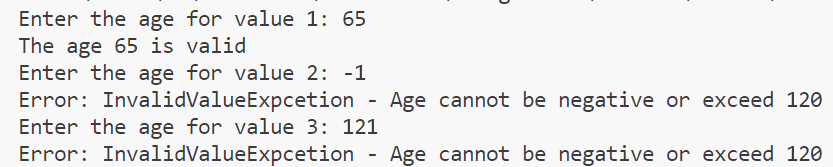
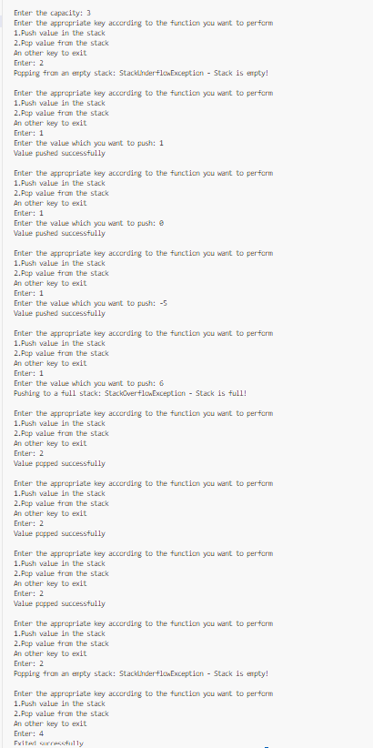
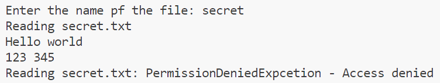
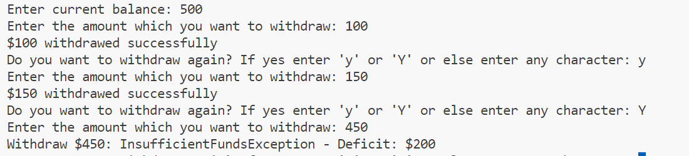

# 24K-0762-OOP-LAB-11
# C++ Code Repository

## Preview
Here are the sample outputs of the programs:

### Task 1 Output:


### Task 2:


### Task 3:


### Task 4:


### Task 5:



---

## Code
Below are the C++ programs:

### Program 1: 
```cpp
#include<iostream>
#include<stdexcept>
using namespace std;
class InvalidValueExpcetion: public std::exception{
    const char* what() const noexcept override{
        return "Error: InvalidValueExpcetion - Age cannot be negative or exceed 120";
    }
    public:
        void validateAge(int age){
            try{
                if(age<0||age>120){
                    throw *this;
                }
                cout<<"The age "<<age<<" is valid"<<endl;
            }
            catch(InvalidValueExpcetion &invalid){
                cout<<invalid.what()<<endl;
            }
        }
};
int main(){
    int age;
    InvalidValueExpcetion value1,value2,value3;
    cout<<"Enter the age for value 1: ";
    cin>>age;
    value1.validateAge(age);
    cout<<"Enter the age for value 2: ";
    cin>>age;
    value2.validateAge(age);
    cout<<"Enter the age for value 3: ";
    cin>>age;
    value3.validateAge(age);
    return 0;
}


## Code
Below are the C++ programs:

### Program 2: 
```cpp

#include<iostream>
#include<stdexcept>
using namespace std;
class StackOverFlowException: public std::exception{
    public:
        const char* what(){
            return "Pushing to a full stack: StackOverflowException - Stack is full!";
        }
};
class StackUnderFlowException: public std::exception{
    public:
        const char* what(){
            return "Popping from an empty stack: StackUnderflowException - Stack is empty! ";
        }
};
template <typename T>
class Stack{
    const int capacity;
    T *data;
    int pos;
    public:
        Stack(int cap):capacity(cap),pos(-1),data(new T[capacity]){}
        void push(T value){
            try{
                if(pos>=capacity-1){
                    throw StackOverFlowException();
                }
                data[++pos]=value;
                cout<<"Value pushed successfully"<<endl;
            }
            catch(StackOverFlowException &overflow){
                cout<<overflow.what()<<endl;
            }
        }
        void pop(){
            try{
                if(pos<0){
                    throw StackUnderFlowException();                    
                }
                data[pos--]=T();
                cout<<"Value popped successfully"<<endl;
            }
            catch(StackUnderFlowException &underflow){
                cout<<underflow.what()<<endl;
            }
        }
        ~Stack(){
            delete[] data;
        }
};
int main(){
    int capacity,value,choice;
    cout<<"Enter the capacity: ";
    cin>>capacity;
    Stack<int> stack(capacity);
    do{
        cout<<"Enter the appropriate key according to the function you want to perform\n1.Push value in the stack\n2.Pop value from the stack\nAn other key to exit\nEnter: ";
        cin>>choice;
        switch (choice){
            case 1:
                cout<<"Enter the value which you want to push: ";
                cin>>value;
                stack.push(value);
                break;    
            case 2:
                stack.pop();
                break;
            default:
                cout<<"Exited successfully";
        }
        cout<<endl;
    }while(choice==1||choice==2);
    return 0;
}


## Code
Below are the C++ programs:

### Program 3: 
```cpp

#include<iostream>
#include<fstream>
#include<stdexcept>
using namespace std;
class FileExpcetion:public std::exception{
    public:
        virtual const char* what(){
            return "Expection found in file";
        }
};
class FileNotFoundExpcetion: public FileExpcetion{
    public:
        const char* what(){
            return "File not found";
        }
};
class PermissionDeniedExpcetion: public FileExpcetion{
    public:
        const char* what(){
            return "PermissionDeniedExpcetion - Access denied";
        }
};
void readFile(const string& filename){
    ifstream file(filename);
    if(!file.is_open()){
        throw FileNotFoundExpcetion();
    }
    cout<<"Reading "<<filename<<".txt"<<endl;
    string line;
    while(1){
        getline(file,line);
        if(file.fail()){
            throw PermissionDeniedExpcetion();
        }
        cout<<line<<endl;
    }
}
int main(){
    string filename;
    cout<<"Enter the name pf the file: ";
    cin>>filename;
    try{
        readFile(filename);
    }
    catch(FileExpcetion &exception){
        cout<<"Reading "<<filename<<".txt: "<<exception.what()<<endl;
    }    
    catch(FileNotFoundExpcetion &notFound){
        cout<<notFound.what()<<endl;
    }
    catch(PermissionDeniedExpcetion &denied){
        cout<<"Reading "<<filename<<".txt: "<<denied.what()<<endl;
    }
    return 0;
}


## Code
Below are the C++ programs:

### Program 4: 
```cpp

#include <iostream>
#include <typeinfo>
#include <cmath>
using namespace std;
class NegativeNumberException {
public:
    void exception() {
        cout << "NegativeNumberException - Input must be non-negative!" << endl;
    }
};
class InvalidTypeException {
public:
    void exception() {
        cout << "InvalidTypeException - Non-numeric type detected!" << endl;
    }
};
template <typename T>
void compute_sqrt(T num) {
    try{
        cout<<"sqrt("<<num<<"): ";
        if(typeid(num)!=typeid(int)&&typeid(num)!=typeid(float)&&typeid(num)!=typeid(double)){
            throw InvalidTypeException()
            return;
        }
        cout<<sqrt(static_cast<double>(num)) << endl;
    }
    catch(InvalidTypeException invalid){
        invalid.exception();
    }
    try{
        cout<<"sqrt("<<num<<"): ";
        if(num<0){
            throw NegativeNumberException()
            return;
        }
        cout<<sqrt(static_cast<double>(num)) << endl;
    }
    catch(NegativeNumberException negative){
        negative.exception();
    }
}   
int main() {
    cout<<"Finding square root of 5"<<endl;
    compute_sqrt(5);    
    cout<<endl<<"Finding square root of 6.25"<<endl;
    compute_sqrt(6.25);      
    cout<<endl<<"Finding square root of 0"<<endl;
    compute_sqrt(0);         
    cout<<endl<<"Finding square root of -6"<<endl;
    compute_sqrt(-6);        
    cout<<endl<<"Finding square root of -9.4"<<endl;
    compute_sqrt(-9.4); 
    cout<<endl<<"Finding square root of 'a'"<<endl;
    compute_sqrt('a');       
    cout<<endl<<"Finding square root of 'Hello'"<<endl;
    compute_sqrt("hello");   
    return 0;
}


## Code
Below are the C++ programs:

### Program 5: 
```cpp

#include<iostream>
using namespace std;
class InsufficientFundsException{
    public:
        string execption(){
            return "InsufficientFundsException - Deficit: ";
        }
};
template <typename T>
class BankAccount{
    T balance;
    public:
        BankAccount(T balance):balance(balance){}
        void withdraw(T amount){
            try{    
                if(amount>balance){
                    throw InsufficientFundsException();
                }
                balance-=amount;
                cout<<"$"<<amount<<" withdrawed successfully"<<endl;
            }
            catch(InsufficientFundsException funds){
                cout<<"Withdraw $"<<amount<<": "<<funds.execption()<<"$"<<amount-balance<<endl;
            }
        }
};
int main(){
    double balance,withdraw;
    char c;
    cout<<"Enter current balance: ";
    cin>>balance;
    BankAccount<double> account(balance);
    while(1){
        cout<<"Enter the amount which you want to withdraw: ";
        cin>>withdraw;
        account.withdraw(withdraw);
        cout<<"Do you want to withdraw again? If yes enter 'y' or 'Y' or else enter any character: ";
        cin>>c;
        if(c!='Y'&&c!='y'){
            break;
        }
    }
    return 0;
}

